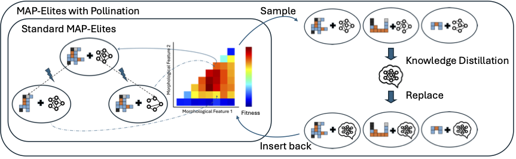

# Controller Distillation Reduces Fragile Brain-Body Co-Adaptation and Enables Migrations in MAP-Elites

This is the code for the paper "Controller Distillation Reduces Fragile Brain-Body Co-Adaptation and Enables Migrations in MAP-Elites".

## A *really* short summary

Fragile co-adaptation resists the core mechanics of MAP-Elites -- migrations. Because body mutations result in significant performance drop, solutions with body mutations are less likely to outperform an existing elite in a niche, so they get eliminated from the population, resulting in poor search over the morphology space. We do policy distillation to create controllers that are robust to morphological mutations, enabling migrations.

</img>

